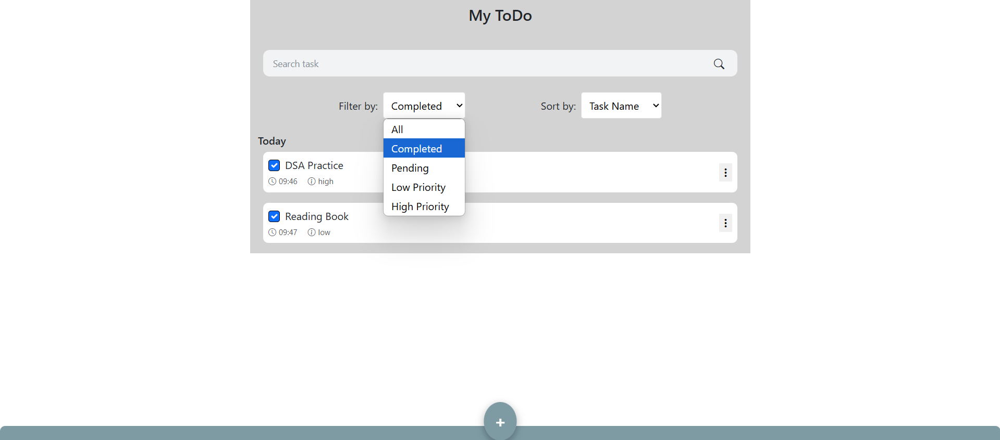
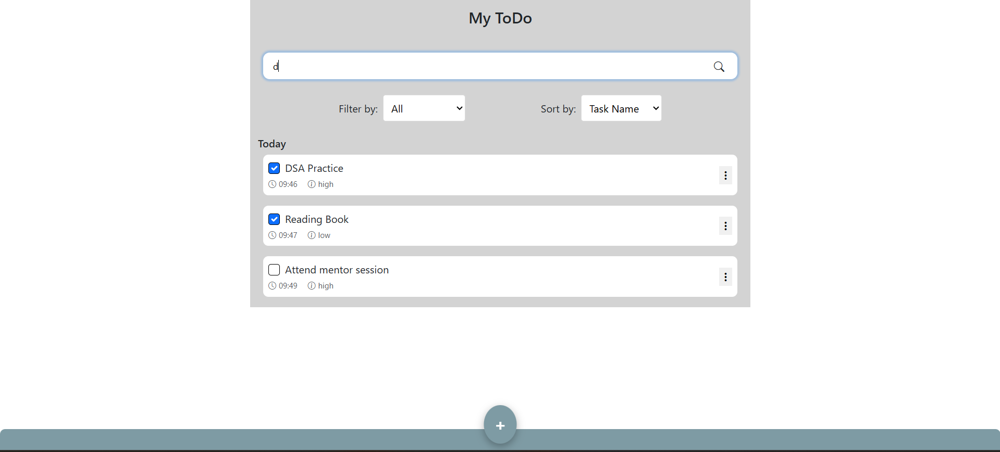
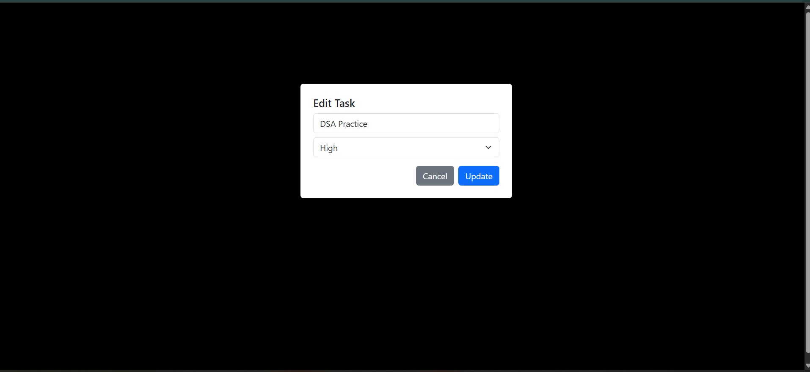
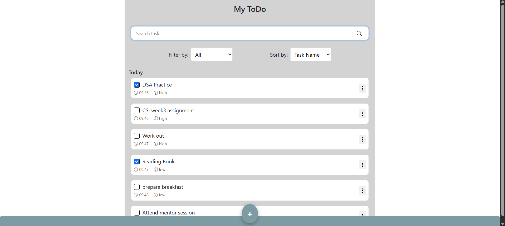
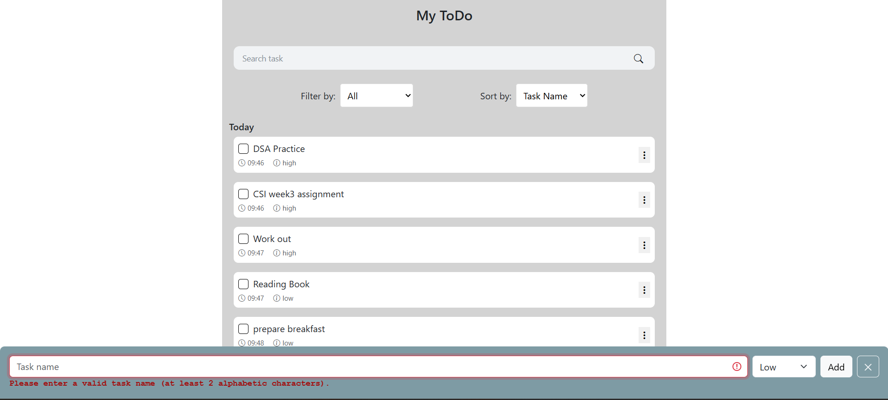

---

---

# 📝 React ToDo App

This is a fully functional **Task Management Web App** built using **ReactJS** and **Redux**. It enables users to add, update, delete, search, filter, and sort tasks with persistent data saved in **localStorage**. This app also includes real-time input validation and dynamic dropdown actions.

## 🚀 Features

- ✅ Add new tasks with priority selection.
- ✏️ Edit and update tasks with pre-filled forms.
- ❌ Remove tasks with instant update and persistence.
- 🔄 Toggle task status between **Pending** and **Completed**.
- 🔍 Search tasks by name in real-time.
- 🔃 Sort tasks by:
  - Task name
  - Newest first
  - Oldest first
- 📂 Filter tasks by:
  - Completed
  - Pending
  - High Priority
  - Low Priority
- 🧠 Intelligent validation to avoid empty or invalid task names.
- 💾 Persistent data using `localStorage`.

---

## 🖼️ Screenshots
---

> Folder path: `screenshot/`

### 📊 Filter and Sorting


### 🔎 Search Functionality


### 🔁 Update Task


### 🗂️ My Tasks View


### ❗Validation Error


---

## 📁 Folder Structure (Important Parts)

```

/src
├── components/
│   ├── TaskForm.jsx         # Form to add/edit tasks
│   ├── TaskList.jsx         # Task listing component
│   └── FilterSortPanel.jsx  # Filtering & sorting dropdowns
├── redux/
│   ├── action.js            # Redux actions (add, remove, update, filter)
│   ├── reducer.js           # Reducer handling task state
│   └── store.js             # Configured Redux store
├── utils/
│   └── validation.js        # Task name input validation
├── App.js
└── index.js

````

## 🧠 Technologies Used

* ReactJS
* Redux Toolkit
* JavaScript (ES6)
* HTML/CSS (Bootstrap & Custom)
* LocalStorage API

---

## 📌 How to Run the Project

1. Clone the repository:

   ```
   git clone https://github.com/Dharmendra2567/react-to-do-app
   ```
2. Navigate into the project folder:

   ```
   cd react-to-do-app
   ```
3. Install dependencies:

   ```
   npm install
   ```
4. Start the development server:

   ```
   npm start
   ```

---

## 📧 Author

**Dharmendra Sah**
🚀 Frontend Developer | 📚 Lifelong Learner

---